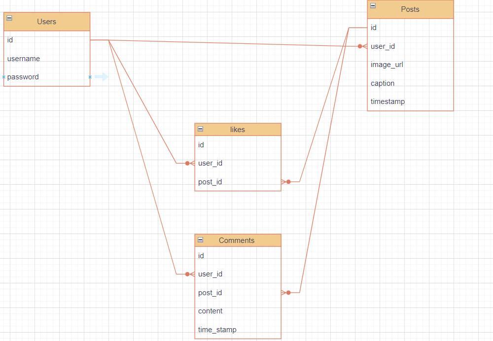

# instagram clone Project Plan

## Features

- User uthentication (sign up/sign in )
- Post Creation (Image URL + Caption)
- Global Post Feed
- Likes
- Comments
- Simple User Profile

## Architecture

- **Frontend:** React with Vite
- **Backend:** Python (Flask) with SQLite
- **Image Storage:** External URL (for this plan's Scope)
- **Authentication:** JWT

## Database Schema

